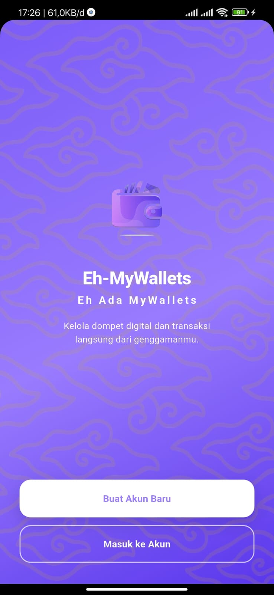
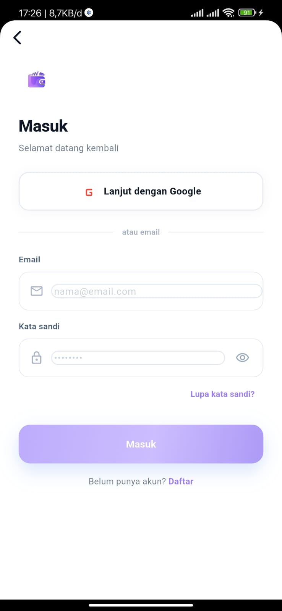
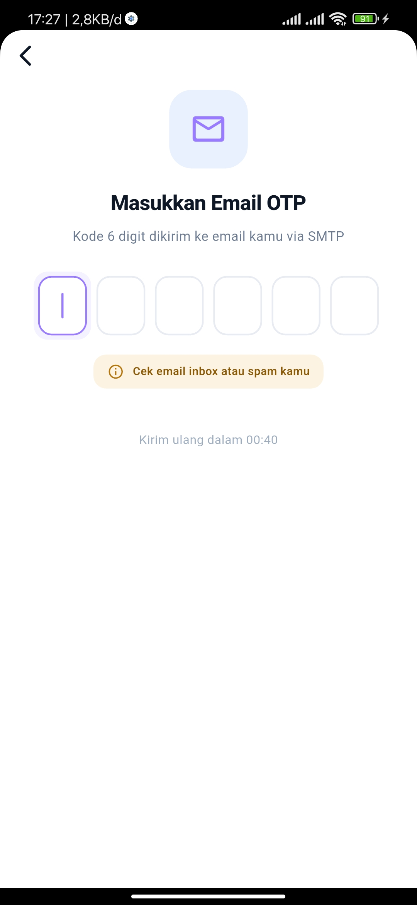
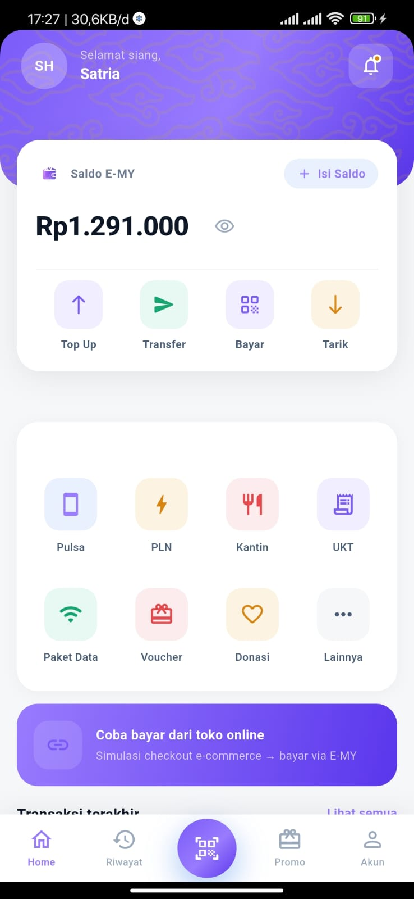
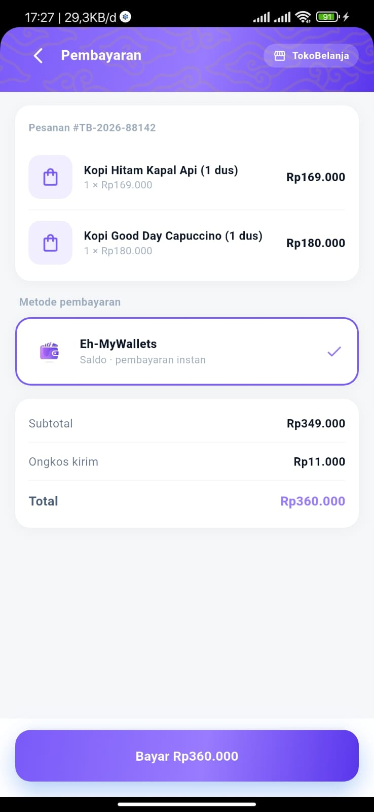
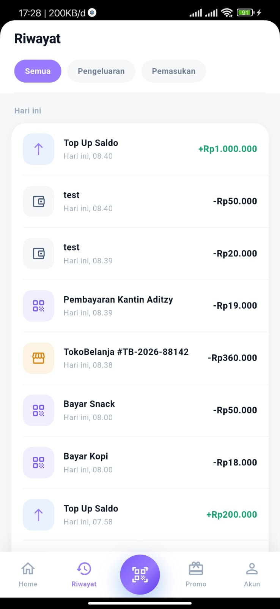
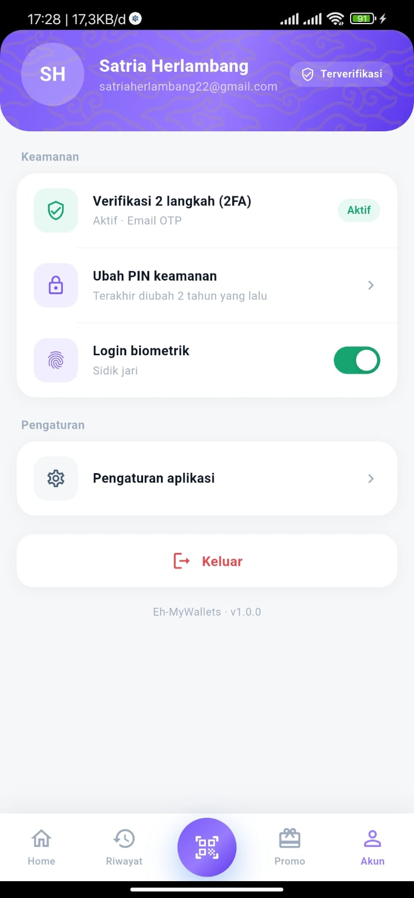

# Eh-MyWallets

###  Project UAS Mobile Programming
  - Mata Kuliah : Aplikasi Mobile Lanjutan
  - NIM : 1123150070
  - Nama : Satria Herlambang
  - Kelas : TI 23 SE 1 
  - Dosen : I Ketut Gunawan, S.KOM, M.T.I 
  - Konsentrasi : Software Engineering
  - Prodi : Teknik Informatika
  - Semester : Genap
  - Tahun Akademik: 2026 - 2027

---

### Eh-MyWallets aplikasi apa sih itu?

Eh-MyWallets adalah aplikasi e-money modern yang dirancang untuk memudahkan transaksi pembayaran, transfer saldo, dan manajemen keuangan digital. Aplikasi ini dikembangkan sebagai solusi pembayaran praktis dengan antarmuka yang intuitif dan sistem keamanan terintegrasi.

Aplikasi ini juga sebagai project tugas akhir UAS mata kuliah mobile programming loh yah di <b>Global Institut Teknologi Bina Sarana Global</b> pada semester genap 2026/2027.

## Fitur Utama

- **Authentication:** Login aman menggunakan integrasi Firebase Auth & Google Sign-In.
- **QRIS Scanner:** Pembayaran merchant yang cepat melalui pemindaian kode QR.
- **Wallet Management:** Kelola saldo, riwayat transaksi, dan poin reward secara real-time.
- **Transfer Antarbank:** Fitur transfer dana yang efisien dan aman.
- **Promo & Rewards System:** Katalog promo dinamis dengan UI premium untuk menarik engagement pengguna.
- **Real-time Order Synchronization:** Sinkronisasi detail pesanan dan status "Pembayaran Berhasil" secara real-time setelah kembali dari aplikasi pihak ketiga.
- **App-to-App Integration (Deep Linking):** Integrasi pembayaran seamless dengan aplikasi pihak ketiga eksternal E-commerce (Ngopss-App) menggunakan URI Link Stream dan callback status pembayaran otomatis.

## Tech Stack

- **Framework:** Flutter (Dart)
- **State Management:** BLoC (Business Logic Component)
- **Backend:** Firebase (Auth, Firestore, Cloud Functions)
- **Networking:** Dio (HTTP Client)
- **Navigation:** GoRouter
- **Storage:** Flutter Secure Storage

## Preview Aplikasi

<p align="center">
    
    
    
    
</p>

<p align="center">
    
    
    
</p>

## Struktur Project (Clean Architecture)

Aplikasi ini menerapkan prinsip pemisahan tanggung jawab (*Separation of Concerns*) dengan memisahkan logika bisnis (BLoC), layanan data, dan antarmuka pengguna (UI). Struktur ini memastikan *codebase* tetap rapi, mudah di- *maintenance*, dan siap untuk diskalakan.

```text
eh_mywallets/
├── android/                 # Konfigurasi native Android (App Name, Icons, Permissions)
├── assets/                  # Aset statis aplikasi
│   ├── icons/               # Launcher icon dan sistem icon
│   └── images/              # Banner promo, pattern background, dan ilustrasi
├── lib/
│   ├── blocs/               # Lapisan Logika Bisnis (State Management)
│   │   ├── auth/            # AuthBloc, AuthEvent, AuthState
│   │   └── payment/         # Pengelolaan state transaksi & App-to-App deep link
│   ├── core/                # Konfigurasi inti dan utilitas global
│   │   ├── router/          # AppRouter (GoRouter navigation tree)
│   │   └── theme/           # AppColors (Gradasi, semantic colors) & Typography
│   ├── data/                # Lapisan Data (Models & Repositories)
│   │   ├── models/          # Representasi struktur data (OrderModel, UserModel)
│   │   └── repositories/    # Pengelola aliran data dari API/Firebase ke aplikasi
│   ├── presentation/        # Lapisan Antarmuka Pengguna (UI/UX)
│   │   ├── pages/           # Layar utama (Splash, Home, Promo, Merchant Payment)
│   │   └── widgets/         # Komponen UI reusable (FeatureIcon, AppBadge, AppButton)
│   ├── services/            # Layanan integrasi eksternal
│   │   └── firebase/        # Google Sign-In, Firebase Auth, dan Firestore setup
│   ├── utils/               # Fungsi bantuan (Helpers & Formatters)
│   │   └── currency_fmt/    # Formatter otomatis ke format Rupiah (Rp)
│   └── main.dart            # Entry point aplikasi (Root Setup & Provider Initialization)
├── pubspec.yaml             # Manajemen dependensi aplikasi
└── README.md                # Dokumentasi utama
```

## Implementasi Deep Link & Keamanan (2FA)

### Mekanisme Deep Link (App-to-App)

Aplikasi ini menggunakan skema URI (`ngopss://`) untuk berintegrasi secara *seamless* dengan aplikasi E-Commerce.

* **Penerimaan Data:** Menggunakan *package* `app_links` pada metode `initState` untuk menangkap aliran data (*stream*) dari aplikasi pihak ketiga.
* **Ekstraksi & Validasi:** Payload yang diterima berisi total tagihan dan ID pesanan akan diekstrak tanpa memerlukan validasi form manual karena data bersifat *immutable* dari *merchant*.
* **Callback Status:** Setelah transaksi selesai, aplikasi menggunakan `LaunchMode.externalApplication` untuk memaksa OS Android mengembalikan *user* ke E-Commerce dengan membawa *flag* status pembayaran (Berhasil/Gagal).

### Two-Factor Authentication (2FA)

Mekanisme keamanan lapis ganda diterapkan pada fase autentikasi pengguna.

* **Layer 1 (Kredensial):** Autentikasi utama menggunakan Firebase Authentication dan Google Sign-In.
* **Layer 2 (Verifikasi Perangkat/OTP):** Mengandalkan ekosistem keamanan Google Workspace yang membutuhkan persetujuan *login* dari perangkat utama atau pengiriman kode OTP ke nomor ponsel yang terdaftar sebelum sesi (token) diberikan ke aplikasi.

## Arsitektur & Struktur Sistem

Proyek ini terintegrasi erat dengan aplikasi E-Commerce (Ngopss-App )menggunakan protokol **Deep Linking** (`emoney://` dan `ngopss://`) untuk alur pembayaran, serta berkomunikasi dengan backend masing-masing melalui REST API.

### Diagram Arsitektur Gabungan (High-Level)

* **Client Apps (Flutter):** E-Commerce App & E-Money Wallet App
* **Backend Services:** E-Commerce Go Backend, E-Money Go Backend, & Firebase Auth
* **Databases:** MySQL (E-Commerce DB & Wallet DB)

### Arsitektur Backend (Golang-Gin & GORM)

Layanan backend dibangun menggunakan bahasa **Go** dengan framework **Gin Gonic** untuk performa tinggi, serta **GORM** sebagai ORM ke database MySQL dengan fitur *Auto-Migration*.

### Alur Integrasi Pembayaran (Inter-App Deep Linking)

1. E-Commerce *request* untuk transaksi baru (Checkout) -> Backend mengembalikan `invoice_id` & `total_amount` dengan status `PENDING`.
2. E-Commerce membuka Deep Link: `emoney://pay?invoice_id=...&amount=...&token=...`
3. E-Money memproses pembayaran & verifikasi keamanan (PIN + 2FA Google Authenticator/OTP).
4. E-Money mengirim *callback* sukses: `ngopss://success?invoice_id=...`
5. E-Commerce memanggil API backend `PUT /v1/transactions/:invoice_id` untuk memperbarui status transaksi menjadi `SUCCESS`.

## Cara Menjalankan Project

1. Lakukan proses *clone repository* ke mesin lokal Anda:
    ```bash
    git clone [https://github.com/str122-xyz/E-Wallets-pake-s.git]
    ```

2. Masuk ke direktori proyek:
    ```bash
    cd nama project/repo
    ```

3. Unduh semua dependensi yang diperlukan:
    ```bash
   flutter pub get
    ```
4. Jalankan aplikasi pada emulator atau perangkat fisik:
    ```bash
   flutter run
   ```

5. (Opsional) Untuk membuat *file* instalasi APK:
    ```bash
   flutter build apk --release
   ```

## Daftar Dependensi Utama

Aplikasi ini dibangun menggunakan *library* pendukung berikut untuk mengoptimalkan performa dan fitur:

* **flutter_bloc:** ^9.0.0 (State Management)
* **firebase_auth:** ^5.5.2 (Autentikasi User)
* **go_router:** ^14.8.1 (Navigasi & Deep Linking routing)
* **app_links:** ^6.4.1 (Penangkap URI Deep Link)
* **dio:** ^5.7.0 (HTTP Request)
* **mobile_scanner:** ^7.0.0 (Pemindai QRIS)

## Repositories Project Terkait, Demo Presentasi & Download Aplikasi

### Github Repository Project Terkait

* [Ngopss-App](https://github.com/str122-xyz/1123150070-uts) - E-Commerce (Frontend Flutter 1)

* [Eh-MyWallets](https://github.com/str122-xyz/E-Wallets-pake-s) - E-Money (Frontend Flutter 2)

* [Backend Ngopss-App](https://github.com/str122-xyz/Week-5) - Backend Api E-commerce
(Backend Go Ngopss)

* [Backend Eh-MyWallets](https://github.com/str122-xyz/go2fa) - Backend Api E-Money
(Backend Go Eh-MyWallets)

### Demo Presentasi

* [Demo Presentasi Video](https://youtu.be/bD0tWplvfSg?si=dNSH_CYnYCAb6iq7)

### Download Aplikasi

**Latest Release v1.0.0**<br>

[](https://github.com/str122-xyz/E-Wallets-pake-s/releases/tag/v1.0.0)

---

1123150070<br>
Satria Herlambang
